### http-echo-json

#### 简介

基于jfinal开发,返回一些常见的json数据,为其它端提供测试数据

#### http 接口

##### /

请求

| key      | desc     |
|----------|----------|
| 请求接口 | /        |
| 请求方式 | get/port |
| 请求数据 | 无       |

响应

| this is index |
|---------------|

##### json/getUser

请求

| key      | desc          |
|----------|---------------|
| 请求接口 | /json/getUser |
| 请求方式 | get/port      |
| 请求数据 | 无            |

响应

| { "address": "California", "name": "ping" } |
|---------------------------------------------|

##### json/loadUser

请求

| key      | desc           |
|----------|----------------|
| 请求接口 | /json/loadUser |
| 请求方式 | get/port       |
| 请求数据 | 无             |

响应

| { "address": "California", "name": "ping" } |
|---------------------------------------------|

#### 请求示例

http://60418942-1709155087484149.test.functioncompute.com/

http://60418942-1709155087484149.test.functioncompute.com/json/getUser

http://60418942-1709155087484149.test.functioncompute.com/json/loadUser

### 部署到阿里云函数计算

#### 创建web应用

访问https://fc.console.aliyun.com/fc/overview/cn-hangzhou

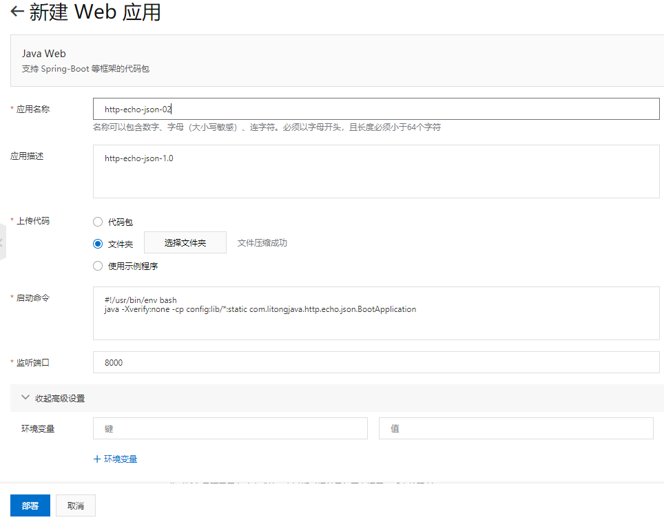

上传代码时选择代码文件夹

监听端口设置为实际的服务启动端口

启动命令

java -Xverify:none -cp config:lib/\*:static
com.litongjava.http.echo.json.BootApplication

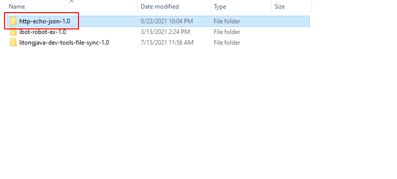

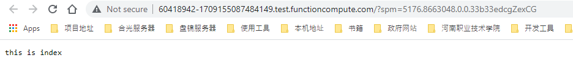

#### 查看域名并测试

##### 查看域名

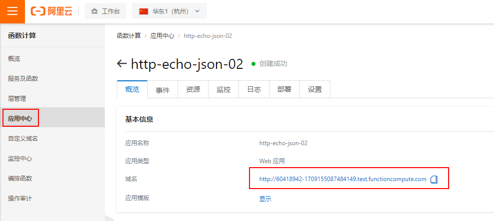

##### 测试

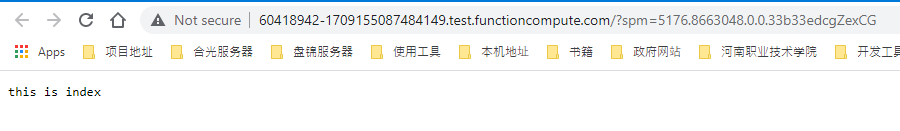

访问的域名是http://60418942-1709155087484149.test.functioncompute.com/

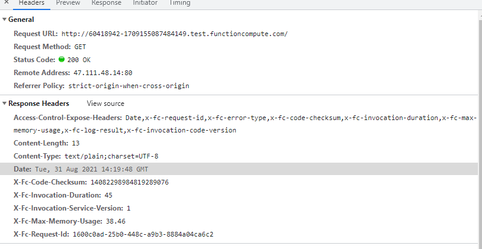

#### 服务及函数

部署成功后再服务和函数中会生成2个服务

| http-echo-json-02-QualifierHelper-ADF9AAF79E6C   |   |
|--------------------------------------------------|---|
| http-echo-json-02-http-echo-json-02-EFBED82B0BF1 |   |

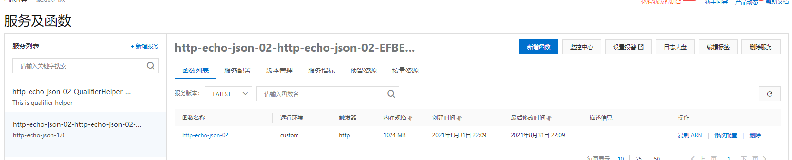

#### 查看源文件

服务及函数--\>函数名--\>代码执行

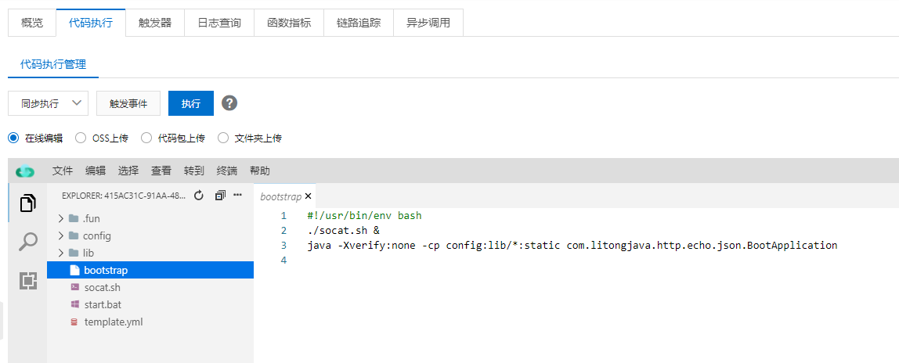

bootstrap
```
#!/usr/bin/env bash
./socat.sh &
java -Xverify:none -cp config:lib/*:static com.litongjava.http.echo.json.BootApplication
```

socat.sh
```
#!/usr/bin/env bash
while ! &>/dev/null </dev/tcp/127.0.0.1/8000; do
    sleep 0.01;
done
socat TCP4-LISTEN:9000,reuseaddr,fork TCP4:127.0.0.1:8000
```


猜测socat文件应该没有什么用

template.yml
```
ROSTemplateFormatVersion: '2015-09-01'
Transform: 'Aliyun::Serverless-2018-04-03'
Resources:
  demo:
    Type: 'Aliyun::Serverless::Service'
    Properties:
      Description: This is demo service
      NasConfig: Auto
    func:
      Type: 'Aliyun::Serverless::Function'
      Properties:
        Handler: index.handler
        Runtime: custom
        CodeUri: ./
```


#### 查看域名

点击自定义域名--\>查看到自定义域名的配置如下

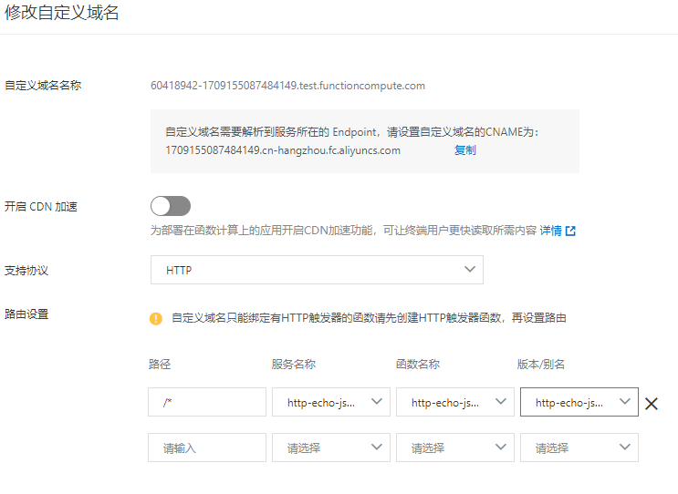

| 路径 | 服务名称                                         | 函数名称          | 版本/别名         |
|------|--------------------------------------------------|-------------------|-------------------|
| /\*  | http-echo-json-02-http-echo-json-02-EFBED82B0BF1 | http-echo-json-02 | http-echo-json-02 |

为什么会有两个域名

| http://60418942-1709155087484149.test.functioncompute.com/ | 成功 |
|------------------------------------------------------------|------|
| http://1709155087484149.cn-hangzhou.fc.aliyuncs.com/       | 失败 |

#### 自定义域名

设置一个cname解析

| http-echo-json.demo.ping0.top | 1709155087484149.cn-hangzhou.fc.aliyuncs.com |
|-------------------------------|----------------------------------------------|

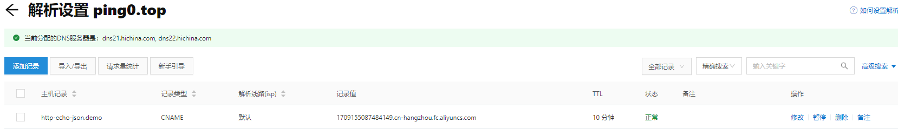

在函数计算中添加自定义域名

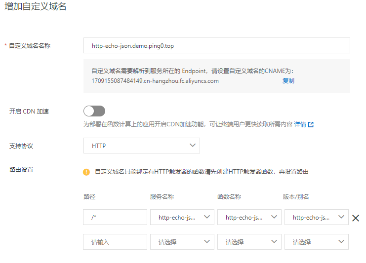
